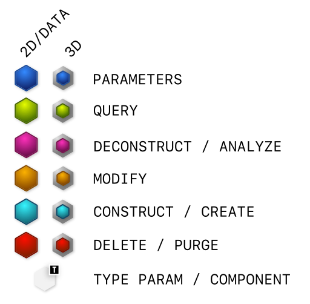

This directory contains the graphic files associated with this project.

- Source files are generated using [Affinity Designer](https://affinity.serif.com/en-gb/designer/) or [Affinity Photo](https://affinity.serif.com/en-gb/photo/) and is exported to PNG and SVG
- [svgexport](https://github.com/shakiba/svgexport) can be used to safely batch-convert SVG files to other image file formats. See link for installation and usage
- The windows icon files (`*.ico`) are generated using [IcoFX](https://icofx.ro/)

**Note**

No matter which authoring software that is used to generate vector graphics, always save a copy of the design as SVG. This should be the source for generating other image formats


# Project Logo

- `logo.png`
- `logo.svg`

# Newsletters

Highlighting new components:

- `newsletters/new-components-highlight.afphoto`


# YouTube Channel

Banner files are

- `yt-channel/youtube-banner.afphoto`
- `yt-channel/youtube-banner.png`

Video thumbnails source file is

- `yt-channel/video-thumbnails.afphoto`


# Grasshopper Component Icons

- `gh-icons/gh-font.svg`: the basic font vector graphics for component icons
- `gh-icons/rir-styles.afdesign`: styles for icons
  - `gh-icons/rir-styles.svg`: templates and styles for icons in SVG
- `gh-icons/params`: parameter icons in SVG
  - `gh-icons/params/src`: source files for parameter icons
- `gh-icons/comps`: component icons in SVG
  - `gh-icons/comps/src`: source files for component icons

## Icon Design Guidelines

See [Grasshopper Icons](https://developer.rhino3d.com/guides/grasshopper/grasshopper-icons/) on general guidelines for designing parameter and component icons for Grasshopper

These are general guidelines for designing icons for this project. When a new icon is needed, duplicate an existing similar icon and make changes. Templates and styles are available inside `gh-icons/rir-styles.afdesign`

- Use the font file listed above to grab vector graphics for the fonts. It is ok to adjust the final font vector graphics to be pixel perfect
- Revit Primitives have a cube-like frame that resembles the primitives in Grasshopper. The cube is grayed-out and looks like a space when dealing with 3d primitives. The blue cube is used for 2d or conceptual primitives. Category, Family, and Type are represented conceptually as 3 sides of the Revit data organization with different colors

    

- Colors denote type of operation (Query, Analyze, Modify, Create)

    

- Icons for various categories are differentiated by their shape. The color denotes the type of operation the component performs on that category

    

- Where possible use shapes similar to Grasshopper icons e.g. Material primitive icon uses the egg shape of Grasshopper materials

    


## Adding/Creating Icons for Components/Parameters

- [ ] Create the icon design source file (maybe duplicate a similar existing icon and change) inside the appropriate `gh-icons/<comps | params>/src/` directory
- [ ] Export a .png of the icon into the `gh-icons/comps/` or `gh-icons/params/` directory
- [ ] Add the icon to the `../src/RhinoInside.Revit.GH/RhinoInside.Revit.GH.csproj` references. Follow the same pattern as the existing reference lines:

```xml
    <None Include="$(ProjectDir)\..\..\art\gh-icons\params\ElementTypeByName.png"><Link>Art\Parameters\ElementTypeByName.png</Link></None>
```
- [ ] Open RhinoInside.Revit.GH project in VisualStudio, browse to Resources, and drag-drop the icon **from the VisualStudio project browser**, into Resources window. This will generate the necessary access codes to `Resources.resx` and `Resources.Designer.cs` files
- [ ] Build the project, Load Revit, and make sure the component or parameter is showing the icon
- [ ] Open the `../docs/update_components_data.ghx` file inside grasshopper. This will update the data file containing information about the components (`../docs/_data/components.json`).The script will also make a copy of the .png file inside `../docs/static/images/GH`
- [ ] Build the wiki, browse to References > Components and make sure the component is listed with its icon
- [ ] Commit the changes with appropriate message


